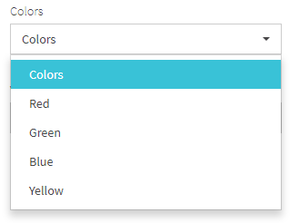

# Documentation
## Extended Selenium features
TBD

## Simple elements
TBD

## Complex elements
### Table
[Test examples](https://github.com/jdi-testing/jdi-light-csharp/blob/master/JDI.Light/JDI.Light.Tests/Tests/Complex/TableTests.cs)

```java 
TBD
```
```csharp 
AlertButton.Click();
AcceptAlert();
```
### DropDown
**DropDown** – a graphical control element, that allows the user to choose one value from a list.



Here is the list of some available methods:

|Method | Description | Return Type
--- | --- | ---
**Select(string/int)** |Select dropdown by value/index  | void
**GetSelected()** |Get selected dropdown value  | string

[Test examples](https://github.com/jdi-testing/jdi-light-csharp/blob/master/JDI.Light/JDI.Light.Tests/Tests/Common/DropDownTests.cs)

```java 
TBD
```
```csharp 
[Test]
public void SelectDropDownExample() 
{
    MyDropDown.Select("some value");
}
[Test]
public void SelectByIndexExample() 
{
    MyDropDown.Select(1);
}
[Test]
public void GetSelectedExample() 
{
    var selected = MyDropDown.GetSelected();
    Assert.AreEqual(selected, "some value");
}
```

### DataList
**DataList** – a graphical control element, that allows the user to choose one value from a list or enter it by himself.


Here is the list of some available methods:

|Method | Description | Return Type
--- | --- | ---
**Select(string/int)** |Select datalist by value/index  | void
**Input(string value)** |Input user's value into datalist  | void
**GetSelected()** |Get selected datalist value  | string

[Test examples](https://github.com/jdi-testing/jdi-light-csharp/blob/master/JDI.Light/JDI.Light.Tests/Tests/Common/DataListTests.cs)

```java 
TBD
```
```csharp 
[Test]
public void SelectDataList() 
{
    MyDataList.Select("some value");
}
[Test]
public void SelectByIndex() 
{
    MyDataList.Select(1);
}
[Test]
public void FillDataList() 
{
    MyDataList.Input("some value");
    SubmitButton.Click();
}
```

### MultiSelector
**MultiSelector** – a graphical control element, that allows the user to do multiple choice.


Here is the list of some available methods:

|Method | Description | Return Type
--- | --- | ---
**Select(string[]/int[])** |Select multiselector by values/indexes  | void
**GetSelected(Array)** |Get selected values  | string[]
**UnselectAll(Array)** |Unselect all values  | void

[Test examples](https://github.com/jdi-testing/jdi-light-csharp/blob/master/JDI.Light/JDI.Light.Tests/Tests/Common/MultiSelectorTests.cs)


```java 
TBD
```
```csharp 
[Test]
public void MultiSelectByValues() 
{
    MyMultiSelector.Select(string[]);
}
[Test]
public void MultiSelectByIndexes() 
{
    MyMultiSelector.Select(int[]);
}
```

###FileInput
**FileInput** - a grafical control element, that allows the user to upload documents on the web site


|Method | Description | Return Type
--- | --- | ---
**SelectFile(string filepath)** |Select file to upload  | void

[Test examples](https://github.com/jdi-testing/jdi-light-csharp/blob/master/JDI.Light/JDI.Light.Tests/Tests/Common/FileInputTests.cs)

```csharp
[Test]
public void FileInputTest()
{
    FileInput.SelectFile(CreateFile(filename));
}

## Composite elements
TBD

## UI Objects
TBD

## JDI Locators
TBD

## Windows/Tabs manager
TBD

## Alerts
**Alert** –  a window with a message that displays on the screen and pauses the execution of the script until the user performs an action

<aside class="notice">
Note that you can make static import in order to simplify code Alerts.acceptAlert() > acceptAlert()
</aside>

Handle Window alerts/confirm/prompt dialogs desribed on <a href='https://developer.mozilla.org/en-US/docs/Web/API/Window' target="_blank">MDN</a>

```java 
alertButton.click();
acceptAlert();
```
```csharp 
AlertButton.Click();
AcceptAlert();
```
```java 
alertButton.click();
dismissAlert();
```
```csharp 
AlertButton.Click();
DismissAlert();
```

alert('Alert')


```java 
alertButton.click();
String text = getAlertText();
acceptAlert();
```
```csharp 
AlertButton.Click();
String text = GetAlertText();
AcceptAlert();
```
```java 
alertButton.click();
validateAlert(is("Red button"));
validateAlert(equalToIgnoringCase("red button"));
validateAlert(containsString("Red"));
```
```csharp 
TBD ValidateAlert
```

confirm()


```java 
alertButton.click();
inputAndAcceptAlert("Some Text");
```
```csharp 
TBD InputAndAcceptAlert
```

prompt('Alert', 'Default value')


## Logs
TBD

## Reports
### Allure
TBD

### Report Portal
TBD

## JDI Settings
TBD

## Driver Settings
TBD

## Parallel tests run
TBD

## Remote test runs
TBD
